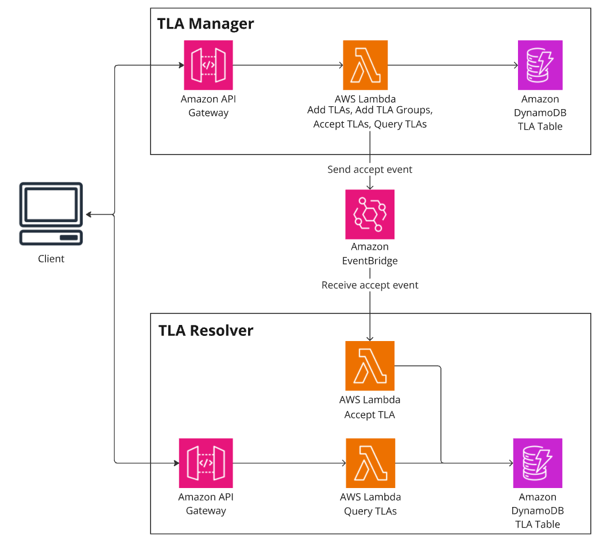
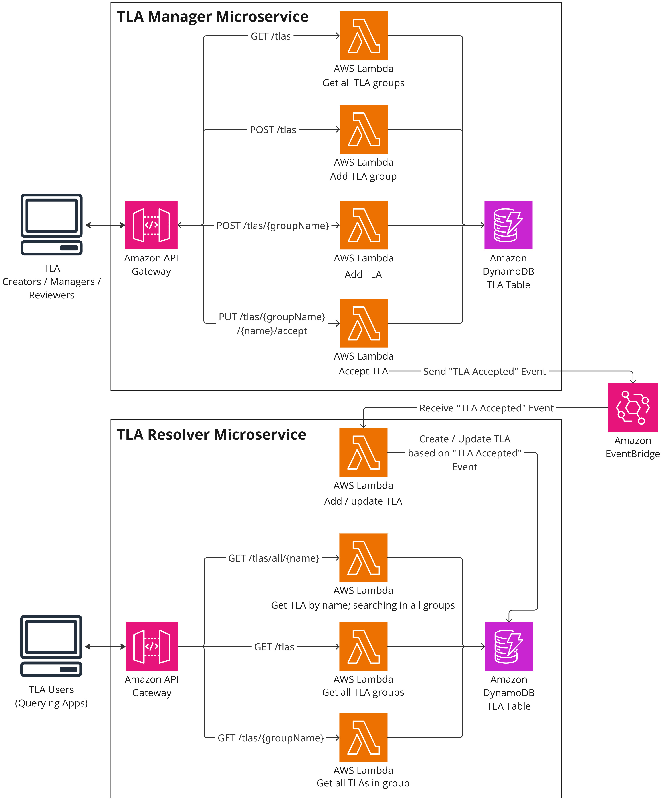

# Three Letter Abbreviations (TLA) Sample Application - Implemented Serverless - Grp09

[](https://github.com/stefan-ka/tla-sample-serverless/actions/workflows/main_build.yml) [](https://opensource.org/licenses/Apache-2.0)

This repository implements the [Three Letter Abbreviations (TLA) Sample Application](https://github.com/ContextMapper/ddd-cm-tla-sample-application) of the [Context Mapper](https://contextmapper.org) project with serverless technology. 
It can easily be deployed on AWS. 
The following graphic gives an architecture overview of the app:



The app uses the following AWS services:
 * **Amazon API Gateway** now serves the RESTful HTTP API to access the TLA's.
 * **AWS Lambda** is used (one function per endpoint) to process the request events of the API gateway, load the data from a DynamoDB table and return a response event back to the gateway.
 * **Amazon DynamoDB** is used to persist the TLA's.
 * **Amazon EventBridge** is used to send events from the manager to the resolver

## Used Technology

The app uses the following tools and frameworks:

 * [Maven](https://maven.apache.org/) to build the resolver app deployable (JAR)
 * [Spring Boot](https://spring.io/projects/spring-boot) and [Spring Cloud Function](https://spring.io/projects/spring-cloud-function) to implement the resolver functions.
 * The [AWS SDK for Java 2.x](https://docs.aws.amazon.com/sdk-for-java/latest/developer-guide/get-started.html) to connect the resolver functions to the DynamoDB and EventBridge.
 * [.NET](https://dotnet.microsoft.com/en-us/) to implement the manager functions. 
 * The [AWS SDK for .NET](https://docs.aws.amazon.com/sdk-for-net/v4/developer-guide/welcome.html) to connect the manager functions to the DynamoDB and EventBridge.
 * The [Serverless Framework](https://www.serverless.com/) to deploy the whole application on AWS.
   * Including the definition of the API endpoints, the DynamoDB table and the EventBridge. 
 * [GitLab CI/CD Pipelines](https://github.com/stefan-ka/tla-sample-serverless/actions) as CI/CD tool to automatically deploy the app to AWS.

The following graphic shows a more detailed architecture overview:



## EventBridge
The "TLA Manager" and "TLA Resolver" communicate through events that are sent to an Amazon EventBridge.
The EventBridge needs to be deployed before the other services, using the following commands:
```bash
cd eventbridge
serverless deploy
```

### Event Types
This section documents the different type of events.

The general format of EventBridge events is documented in the [Amazon documentation](https://docs.aws.amazon.com/eventbridge/latest/ref/overiew-event-structure.html).
All events use the "detail-type" to differentiate between the different types of events.

#### TLA Accepted Event
When accepting a TLA (see [Accept a Proposed TLA](#accept-a-proposed-tla)) the "TLA Manager" sends an event to the EventBridge.
The event includes the necessary information for the "TLA Resolver" to add the accepted TLA to its database.
The event has a `detail-type` of `TLA_Accepted`.

The `detail` of the event has the following format:
```json
{
    "tlaGroupName": "{Name of Group}",
    "tlaGroupDescription": "{Description of TLA Group}",
    "tlaName": "{Name of TLA}",
    "tlaMeaning": "{Meaning of TLA}",
    "tlaAlternativeMeanings": [
        "{Alternative meaning 1}",
        "{Alternative meaning 2}"
    ],
    "tlaLink": "{tla link, nullable}"
}
```

Here, an example of an actual event:

```json
{
    "version": "0",
    "id": "4fb14a18-76fe-f6c8-eccf-65d23adfecbb",
    "detail-type": "TLA_Accepted",
    "source": "TLAManager",
    "account": "64...72",
    "time": "2025-05-26T10:52:59Z",
    "region": "us-east-1",
    "resources": [],
    "detail": {
        "metadata": {
            "version": "1.0",
            "created_at": "5/26/2025 10:52:59 AM",
            "domain": {
                "name": "TLAs",
                "subdomain": "review_process",
                "service": "TLAManager",
                "category": "domain_event",
                "event": "TLA_Accepted"
            }
        },
        "data": {
            "tlaGroupName": "OST",
            "tlaGroupDescription": "OST modules",
            "tlaName": "CldSol",
            "tlaMeaning": "Cloud Solutions",
            "tlaAlternativeMeanings": [],
            "tlaLink": null
        }
    }
}
```

## TLA Manager

### Build and Deploy

As a prerequisite, you must have the [.NET 8 SDK](https://dotnet.microsoft.com/en-us/download) and the [serverless CLI](https://www.serverless.com/framework/docs/getting-started) installed.

Building the app is done using the dotnet CLI.
We provide a build script which executes the necessary commands for you:

```bash
cd manager
./.build.sh
```

The command above creates a zip file `bin/release/net8.0/deploy-package.zip` which contains all the functions (lambdas) of the app.
Once successfully built, the app is easily deployed with:

```bash
serverless deploy
```

_Note:_ `serverless deploy` only works if you have already set up the serverless framework locally, including logging in and connecting to your AWS account. See the [Serverless Framework documentation](https://www.serverless.com/framework/docs/getting-started) for more information on how to do this.

Once `serverless deploy` was successful, you can fill the DynamoDB table with some sample data by executing our `seed_database` function. You can do this via the following command:

```bash
sls invoke --function seed_database --data 'unused'
```

Now you can access the TLA's via the apps API.

### Use Cases and Endpoints
The manager currently supports the following use cases, for which we provide some sample CURLs.

_Disclaimer:_ Please note that we have not implemented any identity and access control measures for this sample application. All endpoints are publicly available; including the writing ones (commands). 

_Note_ that you will need to replace `{baseUrl}` with the URLs you get from `sls deploy` in all the following examples.

| Endpoint                        | Method | Description                                                                                                                                                                                   |
| ------------------------------- | ------ | --------------------------------------------------------------------------------------------------------------------------------------------------------------------------------------------- |
| /tlas                           | GET    | Get all TLA groups including their TLAs (accepted TLAs only).                                                                                                                                 |
| /tlas?status=PROPOSED           | GET    | Get TLAs in PROPOSED state.                                                                                                                                                                   |
| /tlas                           | POST   | Create a new TLA group (see sample payload below). Containing TLAs will be in PROPOSED state.                                                                                                 |
| /tlas/{groupName}               | GET    | Get all TLAs of a specific group.                                                                                                                                                             |
| /tlas/{groupName}               | POST   | Create a new TLA within an existing group (see sample payload below). The created TLA will be in PROPOSED state.                                                                              |
| /tlas/all/{name}                | GET    | Search for a TLA over all groups. This query can return multiple TLAs as a single TLA is only unique within one group.                                                                        |
| /tlas/{groupName}/{name}/accept | PUT    | Accept a proposed TLA ([state transition operation](https://microservice-api-patterns.org/patterns/responsibility/operationResponsibilities/StateTransitionOperation): PROPOSED -> ACCEPTED). |

#### Get All TLA Groups
The `/tlas` (GET) endpoint returns all TLAs of all TLA groups that are in the `ACCEPTED` state (read on to see how to propose and accept new TLAs). Note that all TLAs are part of a group.

**CURL**: `curl -X GET {baseUrl}/tlas`

**Sample output:**

```json
[
    {
        "name":"common",
        "description":"Common TLA group",
        "tlas":[
            {
                "name":"TLA",
                "meaning":"Three Letter Abbreviation",
                "alternativeMeanings":[
                    "Three Letter Acronym"
                ]
            }
        ]
    },
    {
        "name":"AppArch",
        "description":"Application Architecture",
        "tlas":[
            {
                "name":"ADR",
                "meaning":"Architectural Decision Record",
                "alternativeMeanings":[
                ],
                "link":"https://adr.github.io/"
            }
        ]
    },
    {
        "name":"DDD",
        "description":"Domain-Driven Design",
        "tlas":[
            {
                "name":"ACL",
                "meaning":"Anticorruption Layer",
                "alternativeMeanings":[
                ]
            },
            {
                "name":"CF",
                "meaning":"Conformist",
                "alternativeMeanings":[
                ]
            },
            {
                "name":"OHS",
                "meaning":"Open Host Service",
                "alternativeMeanings":[
                ]
            },
            {
                "name":"PL",
                "meaning":"Published Language",
                "alternativeMeanings":[
                ]
            },
            {
                "name":"SK",
                "meaning":"Shared Kernel",
                "alternativeMeanings":[
                ]
            }
        ]
    }
]
```

Note that the endpoint returns all TLAs in state `ACCEPTED` by default.
Use the query parameter `status` with the value `PROPOSED` to list TLAs in the `PROPOSED` state (see example below under "Query Proposed TLAs").

#### Get TLAs of a Specific Group
The endpoint `/tlas/{groupName}` (GET) returns all TLAs of a specific group.

**Sample CURL**: `curl -X GET {baseUrl}/tlas/DDD`

**Sample output:**

```json
{
    "name": "DDD",
    "description": "Domain-Driven Design",
    "tlas": [
        {
            "name": "ACL",
            "meaning": "Anticorruption Layer",
            "alternativeMeanings": []
        },
        {
            "name": "CF",
            "meaning": "Conformist",
            "alternativeMeanings": []
        },
        {
            "name": "OHS",
            "meaning": "Open Host Service",
            "alternativeMeanings": []
        },
        {
            "name": "PL",
            "meaning": "Published Language",
            "alternativeMeanings": []
        },
        {
            "name": "SK",
            "meaning": "Shared Kernel",
            "alternativeMeanings": []
        }
    ]
}
```

#### Search TLA in All Groups
With the endpoint `/tlas/all/{name}` (GET) you can search for a TLA through all groups. Note that this might return multiple results, as TLAs are only unique within one group.

**Sample CURL**: `curl -X GET {baseUrl}/tlas/all/ACL`

**Sample output:**

```json
[
    {
        "name": "DDD",
        "description": "Domain-Driven Design",
        "tlas": [
            {
                "name": "ACL",
                "meaning": "Anticorruption Layer",
                "alternativeMeanings": []
            }
        ]
    }
]
```

#### Create new TLA Group
Via `/tlas` (POST) you can create a new TLA group.

**Sample CURL 1 (without containing TLA)**:
```bash
curl --header "Content-Type: application/json" \
  -X POST \
  -d '{ "name": "FIN", "description": "Finance TLAs", "tlas": [] }' \
  {baseUrl}/tlas
```

**Sample CURL 2 (with containing TLA)**: 
```bash
curl --header "Content-Type: application/json" \
  -X POST \
  -d '{ "name": "FIN", "description": "Finance TLAs", "tlas": [ { "name": "ROI", "meaning": "Return on Investment", "alternativeMeanings": [] } ] }' \
  {baseUrl}/tlas
```

**Sample output:** (created group is returned)

```json
{
    "name": "FIN",
    "description": "Finance TLAs",
    "tlas": [
        {
            "name": "ROI",
            "meaning": "Return on Investment",
            "alternativeMeanings": []
        }
    ]
}
```

Note that the new TLA is now in state `PROPOSED` and not delivered by the endpoints mentioned above. They only return TLAs in state `ACCEPTED` by default. Use the following endpoint ("Accept a Proposed TLA") to accept a proposed TLA.

#### Add New TLA to Existing Group
With the endpoint `/tlas/{groupName}` (POST) you can add a new TLA to an existing group.

**Sample CURL**:
```bash
curl --header "Content-Type: application/json" \
  -X POST \
  -d '{ "name": "ETF", "meaning": "Exchange-Traded Fund", "alternativeMeanings": [] }' \
  {baseUrl}/tlas/FIN
```

**Sample output:** (updated group is returned)

```json
{
    "name": "FIN",
    "description": "Finance TLAs",
    "tlas": [
        {
            "name": "ETF",
            "meaning": "Exchange-Traded Fund",
            "alternativeMeanings": []
        },
        {
            "name": "ROI",
            "meaning": "Return on Investment",
            "alternativeMeanings": []
        }
    ]
}
```

Note that the new TLA is now in state `PROPOSED` and not delivered by the endpoints mentioned above. They only return TLAs in state `ACCEPTED` by default. Use the following endpoint ("Accept a Proposed TLA") to accept a proposed TLA.

#### Query Proposed TLAs
The endpoint `/tlas` (GET) offers a query parameter to list all TLAs in the `PROPOSED` state: `/tlas?status=PROPOSED`

**Sample CURL**: `curl -X GET {baseUrl}/tlas?status=PROPOSED`

**Sample output:**

```json
[
    {
        "name": "FIN",
        "description": "Finance TLAs",
        "tlas": [
            {
                "name": "ETF",
                "meaning": "Exchange-Traded Fund",
                "alternativeMeanings": []
            },
            {
                "name": "ROI",
                "meaning": "Return on Investment",
                "alternativeMeanings": []
            }
        ]
    }
]
```

#### Accept a Proposed TLA
With the endpoint `/tlas/{groupName}/{name}/accept` (PUT) you can accept a TLA ("name") within a group ("groupName").
This is a so-called [state transition operation](https://microservice-api-patterns.org/patterns/responsibility/operationResponsibilities/StateTransitionOperation).

**Sample CURL**: `curl -X PUT {baseUrl}/tlas/FIN/ROI/accept` (puts the TLA 'ROI' in group 'FIN' into state `ACCEPTED`)

This endpoint does not expect a body (JSON) and does also not return one. The command is successful if HTTP state 200 is returned.

Once the TLA is accepted, the query endpoints listed above (such as `/tlas` or `/tlas/{groupName}`) will now list them.

Acceptance of a TLA sends an [Accept TLA Event](#accept-tla-event) to the "TLA Resolver" to add the TLA (and possibly also a new group) to its database.
After this event is handled by the resolver, the query endpoints of the resolver will also list this TLA.

## TLA Resolver

### Build and Deploy Resolver
Building the app and its JAR file is done with Maven:

```bash
cd resolver
./mvnw clean package
```

The command above creates a JAR file `target\tla-resolver-serverless-1.2-SNAPSHOT-aws.jar` which contains all the functions (lambdas) of the app. Once successfully built, the app is easily deployed with:

```bash
serverless deploy
```

_Note:_ `serverless deploy` only works if you have already set up the serverless framework locally, including logging in and connecting to your AWS account. See the [Serverless Framework documentation](https://www.serverless.com/framework/docs/getting-started) for more information on how to do this.

Once `serverless deploy` was successful, you can fill the DynamoDB table with some sample data by executing our `seed_database` function. You can do this via the following command:

```bash
sls invoke --function seed_database --data 'unused'
```

Now you can access the TLA's via the apps API.

### Use Cases and Endpoints
The resolver currently supports the following use cases, for which we provide some sample CURLs.

_Disclaimer:_ Please note that we have not implemented any identity and access control measures for this sample application. All endpoints are publicly available; including the writing ones (commands). 

_Note_ that you will need to replace `{baseUrl}` with the URLs you get from `sls deploy` in all the following examples.

| Endpoint          | Method | Description                                                                                                            |
| ----------------- | ------ | ---------------------------------------------------------------------------------------------------------------------- |
| /tlas             | GET    | Get all TLA groups including their TLAs.                                                                               |
| /tlas/{groupName} | GET    | Get all TLAs of a specific group.                                                                                      |
| /tlas/all/{name}  | GET    | Search for a TLA over all groups. This query can return multiple TLAs as a single TLA is only unique within one group. |

The resolver only lists TLA that have been accepted in the "TLA Manager".
To add a new TLA to the resolver, see the [Accept a Proposed TLA](#accept-a-proposed-tla) API of the "TLA Manager".

#### Get All TLA Groups
The `/tlas` (GET) endpoint returns all TLAs of all TLA groups. Note that all TLAs are part of a group.

**CURL**: `curl -X GET {baseUrl}/tlas`

**Sample output:**

```json
[
    {
        "name":"common",
        "description":"Common TLA group",
        "tlas":[
            {
                "name":"TLA",
                "meaning":"Three Letter Abbreviation",
                "alternativeMeanings":[
                    "Three Letter Acronym"
                ]
            }
        ]
    },
    {
        "name":"AppArch",
        "description":"Application Architecture",
        "tlas":[
            {
                "name":"ADR",
                "meaning":"Architectural Decision Record",
                "alternativeMeanings":[
                ],
                "link":"https://adr.github.io/"
            }
        ]
    },
    {
        "name":"DDD",
        "description":"Domain-Driven Design",
        "tlas":[
            {
                "name":"ACL",
                "meaning":"Anticorruption Layer",
                "alternativeMeanings":[
                ]
            },
            {
                "name":"CF",
                "meaning":"Conformist",
                "alternativeMeanings":[
                ]
            },
            {
                "name":"OHS",
                "meaning":"Open Host Service",
                "alternativeMeanings":[
                ]
            },
            {
                "name":"PL",
                "meaning":"Published Language",
                "alternativeMeanings":[
                ]
            },
            {
                "name":"SK",
                "meaning":"Shared Kernel",
                "alternativeMeanings":[
                ]
            }
        ]
    }
]
```

#### Get TLAs of a Specific Group
The endpoint `/tlas/{groupName}` (GET) returns all TLAs of a specific group.

**Sample CURL**: `curl -X GET {baseUrl}/tlas/DDD`

**Sample output:**

```json
{
    "name": "DDD",
    "description": "Domain-Driven Design",
    "tlas": [
        {
            "name": "ACL",
            "meaning": "Anticorruption Layer",
            "alternativeMeanings": []
        },
        {
            "name": "CF",
            "meaning": "Conformist",
            "alternativeMeanings": []
        },
        {
            "name": "OHS",
            "meaning": "Open Host Service",
            "alternativeMeanings": []
        },
        {
            "name": "PL",
            "meaning": "Published Language",
            "alternativeMeanings": []
        },
        {
            "name": "SK",
            "meaning": "Shared Kernel",
            "alternativeMeanings": []
        }
    ]
}
```

#### Search TLA in All Groups
With the endpoint `/tlas/all/{name}` (GET) you can search for a TLA through all groups. Note that this might return multiple results, as TLAs are only unique within one group.

**Sample CURL**: `curl -X GET {baseUrl}/tlas/all/ACL`

**Sample output:**

```json
[
    {
        "name": "DDD",
        "description": "Domain-Driven Design",
        "tlas": [
            {
                "name": "ACL",
                "meaning": "Anticorruption Layer",
                "alternativeMeanings": []
            }
        ]
    }
]
```

## Environments
This section lists to which environments the application is currently deployed and the respective URLs for them.

### DEV
- Manager: https://s90fwgd3rd.execute-api.us-east-1.amazonaws.com
- Resolver: https://2o6ldow4t6.execute-api.us-east-1.amazonaws.com

## Troubleshooting
### FailedInvocation in Event Bus Rule
If you run into cases where the event cannot be sent from the Event Bus Rule to the Function, AWS provides no detailed error info out of the box.
To get detailed error reporting, a SQS queue (Type: Standard) must be set up.
This queue can then be configured as a Dead Letter Queue for the Event Bus Rule as documented [here](https://stackoverflow.com/a/73727287).
After this is correctly set up, the failed invocations end up in the Dead Letter Queue with more detailed error information.
Most likely, it will be the case that the Event Bus Rule does not have permission to invoke your lambda function, in which case you need to add a Permission to the serverless file.

The Dead Letter Queue could be set up automatically with the serverless framework, however this is currently not supported out of the box in the serverless framework and must be set up using [custom CloudFormation code](https://forum.serverless.com/t/event-bridge-dead-letter-config/15326).
When using custom CloudFormation code, please note that the CloudFormation resources created by the serverless framework have normalised names (e.g. underscores are transformed to "Underscore", dashes to "Dash" etc.) and the capitalisation must [exactly match](https://stackoverflow.com/a/61992891).
See the [serverless documentation for more detail](https://www.serverless.com/framework/docs/providers/aws/guide/resources/) and how to inspect which name the serverless framework uses in CloudFormation.

## Licence
This project is released under the [Apache License, Version 2.0](http://www.apache.org/licenses/LICENSE-2.0).
